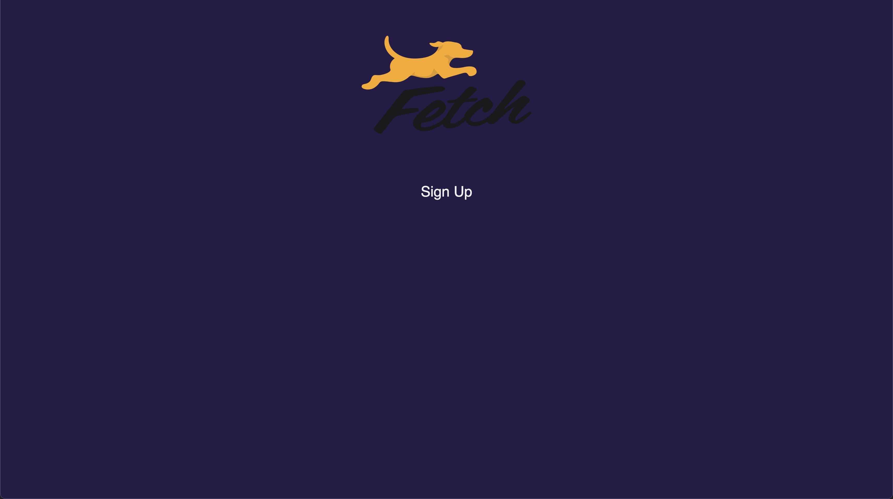

# Fetch Rewards Take Home Exercise

## Description
This is an application taking a user through an experience of a sign-up form. THe user has to fill out the form using a name, email, password, occupation, and state they are from. Upon submission, once all fields are filled. The form will give a feed-back of success or incorrect/missing inputs. 

## Installation Instructions:

- Fork repository
- Clone down repository in terminal 
- Run 'npm i' to download dependencies
- With dependencies installed -- run 'npm run start' 
- Navigate to 'localhost:3000/' to view in browser

## Technologies Used
- HTML
- CSS
- React.Js 

### Endpont Used
- https://frontend-take-home.fetchrewards.com/form

### MVP 
- As a user, I want to be able to sign up using my name, email, password, occupation and state.
- As a user, I want to be able to see what occupations are available to me.
- As a user, I want to be able to choose the state that I'm from.

### Stretch Goals
- As a user, I want to be able to see a success feedback after form is succesfully submitted. 

### Current Application State

